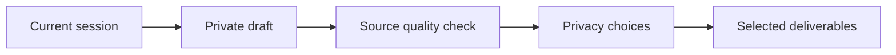

# Learning to Spec

**Carry the learning. Keep the evidence.**

Turn a Copilot conversation into an engineering story and an actionable Agent handoff, backed by linked evidence.

[](https://github.com/fenzhanG2/learning-to-spec/actions/workflows/test.yml)
[](#quick-start)

[Project & results](https://aka.ms/learning-to-spec) · [User guide](docs/user-guide.md) · [Architecture](docs/native-extension.md) · [Report an issue](https://github.com/fenzhanG2/learning-to-spec/issues)

## What you get

Run **`/to-spec`** in your current Copilot session. Choose one reader or both:

| Output | Made for |
| :--- | :--- |
| **Human story · HTML** | Understanding the problem, decisions, implementation and lessons. |
| **Agent handoff · Markdown** | Continuing from the current state, with next actions and verification boundaries. |
| **Linked Evidence · Markdown** | Checking supporting source material when the handoff needs more detail. |

Continue in a fresh session, hand work to another agent, or share an investigation. Keep Agent and Evidence files together.

## Quick start

**Requires:** Python 3.10+, Node.js 18+, authenticated Copilot CLI, and App/CLI support for plugin extensions and native forms. Extension APIs are experimental and subject to organization policy. Rendering dependencies are bundled.

### 1. Install from GitHub

Register the marketplace and install:

```text
copilot plugin marketplace add fenzhanG2/learning-to-spec
copilot plugin install learning-to-spec@learning-to-spec
copilot plugin list
```

No clone or npm install needed. [Install Copilot CLI](https://docs.github.com/en/copilot/how-tos/copilot-cli/cli-getting-started) if `copilot` is unavailable.

### 2. Restart both hosts

**Fully exit and restart both Copilot CLI and Copilot App after installing or updating.** Finish active work first. Confirm App's **Customize → Installed** shows the plugin enabled; start a fresh **Interactive** session.

### 3. Export your current conversation

In your current conversation, enter:

```text
/to-spec
```

Choose readers, delivery and Smart redaction or No redaction. Review your choices and confirm export. Alternatively, ask **“export spec”** to invoke the native tool.

App shows progress, report open buttons and a ZIP download. In CLI without a panel, run `/to-spec` again → **Show saved paths**.

## How it works



- **Session binding.** Freezes the current conversation through the native extension, without transcript discovery.
- **Separate reviews.** Quality checks the source; Smart privacy review sees only the masked draft. No redaction skips privacy review.
- **Bounded processing.** Normally three model calls for Smart mode, two for No redaction. Automatic processing permits at most three calls and five minutes per attempt.
- **Deterministic export.** Final approval renders without another model call. Publication verifies selected files after upload.

## Privacy and quality

Both modes draft from the observable conversation using Copilot quota, including local delivery. Snapshots and intermediate drafts may contain sensitive information; keep them private.

Nothing uploads automatically. ArtifactStore requires authorized Azure CLI access and confirmation of the exact files and audience. Local export requires no Azure access.

Review does not guarantee correctness, anonymity or downstream task success. Failed validation offers a clearly marked **unvalidated draft** when recoverable. [Review and recovery details](docs/user-guide.md#choose-before-generating).

## Update

Finish jobs and close the session first:

```text
copilot plugin update learning-to-spec@learning-to-spec
```

**Fully restart both CLI and App**, then start a fresh Interactive session.

## Explore the docs

| Guide | What it covers |
| :--- | :--- |
| [User guide](docs/user-guide.md) | Installation, export, publication and troubleshooting. |
| [Native architecture](docs/native-extension.md) | Session binding, reviews and approvals. |
| [Output contract](docs/output-contract.md) · [Privacy design](docs/privacy-design.md) | Content requirements and limitations. |
| [Development](docs/user-guide.md#development) · [Testing gates](docs/testing-gates.md) | Builds, validation and host acceptance. |
| [Legacy integrations](docs/legacy/README.md) | Archived MCP/Studio workflows. |

[Report issues](https://github.com/fenzhanG2/learning-to-spec/issues) with host version and reproduction steps, without private sessions, reports or credentials.

<sub>JavaScript/Node.js + Python · [Third-party notices](third_party/NOTICES.md)</sub>
